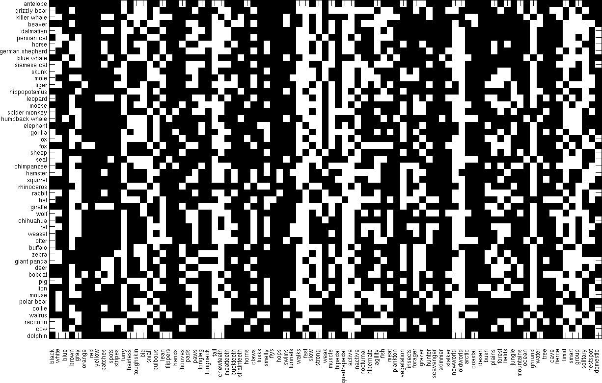
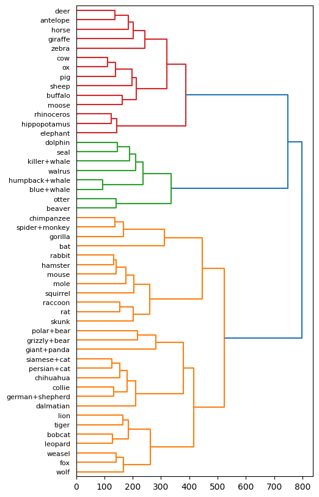

# Hierarchical-Clustering
Illustration of hierarchical clustering on real-world data

This repo uses a small data set that has information about 50 animals. The animals are listed in classes.txt. For each animal, the information consists of values for 85 features: does the animal have a tail, is it slow, does it have tusks, etc. The details of the features are in predicates.txt. The full data consists of a 50 × 85 matrix of real values, in predicate-matrix-continuous.txt. There is also a binarized version of this data, in predicate-matrix-binary.txt. A pictorial representation of the binarized version is shown below.

The code loads the real-valued array, and also the animal names, and hierarchically clusters this data, using Ward’s method. The resulting dendrogram is as follows :-

Following is a comparison of the clusters obtained by Ward's method and K-means clustering.

### Ward’s method :-
Cluster 1 : [’tiger’, ’leopard’, ’fox’, ’wolf’, ’weasel’, ’bobcat’, ’lion’]
Cluster 2 : [’dalmatian’, ’persian+cat’, ’german+shepherd’, ’siamese+cat’, ’chihuahua’, ’collie’]
Cluster 3 : [’grizzly+bear’, ’giant+panda’, ’polar+bear’]
Cluster 4 : [’skunk’, ’mole’, ’hamster’, ’squirrel’, ’rabbit’, ’rat’, ’mouse’, ’raccoon’]
Cluster 5 : [’spider+monkey’, ’gorilla’, ’chimpanzee’, ’bat’]
Cluster 6 : [’beaver’, ’otter’]
Cluster 7 : [’killer+whale’, ’blue+whale’, ’humpback+whale’, ’seal’, ’walrus’, ’dolphin’]
Cluster 8 : [’hippopotamus’, ’elephant’, ’rhinoceros’]
Cluster 9 : [’moose’, ’ox’, ’sheep’, ’buffalo’, ’pig’, ’cow’]
Cluster 10 : [’antelope’, ’horse’, ’giraffe’, ’zebra’, ’deer’]

Cost = 679136.267267262

### K-means clustering:-

Cluster 1 : [’bat’]
Cluster 2 : [’killer+whale’, ’blue+whale’, ’humpback+whale’, ’seal’, ’otter’, ’walrus’, ’dolphin’]
Cluster 3 : [’beaver’, ’persian+cat’, ’siamese+cat’, ’skunk’, ’mole’, ’squirrel’, ’chihuahua’,
’rat’, ’weasel’, ’mouse’, ’collie’, ’raccoon’]
Cluster 4 : [’hamster’, ’rabbit’]
Cluster 5 : [’gorilla’, ’giant+panda’]
Cluster 6 : [’dalmatian’]
Cluster 7 : [’antelope’, ’horse’, ’giraffe’, ’zebra’, ’deer’]
Cluster 8 : [’spider+monkey’, ’chimpanzee’]
Cluster 9 : [’hippopotamus’, ’moose’, ’elephant’, ’ox’, ’sheep’, ’rhinoceros’, ’buffalo’, ’pig’,
’cow’]
Cluster 10 : [’grizzly+bear’, ’german+shepherd’, ’tiger’, ’leopard’, ’fox’, ’wolf’, ’bobcat’, ’lion’,
’polar+bear’]

Cost = 758234.207986508

This experiment shows that Ward's method generates clusters with a lower cost than those generated by K-means clustering. 
